## 2.1.1数据模型分类

**概念数据模型 CDM**：Conceptual Data Model

​	实体-联系模型**E-R**模型

**逻辑数据模型 LDM**：Logic Data Model

​	层次，网状，关系

## 2.1.3逻辑数据模型

### 数据模型的三要素

**数据结构**:描述数据库的组成对象以及对象之间的联系

**数据操纵**:是指对数据库中各种对象的实例允许执行的操作的集合,主要有查询和更新（包括插入、删除、修改）两大类操作。

**完整性约束**:是给定的数据模型中的数据及其联系所具有的制约和依存规则，用以限定符合数据模型的数据库状态以及状态的变化，以保证数据的正确、有效和相容。

## 2.1.4 层次模型

层次模型（hierarchical data model），数据模型是有根的定向有序树，表示各类实体以及实体间的联系。

1. 只有一个结点没有双亲结点，称为根结点。
2. 根以外的其他结点有且只有一个双亲结点。

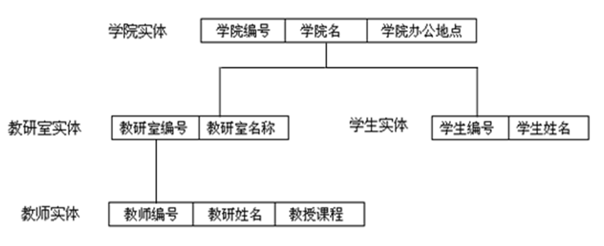

优点

​	层次模型的数据结构比较简单清晰。

​	记录之间的联系通过指针实现，查询效率较高。

缺点

​	现实世界中很多联系是非层次性的，如结点之间具有多对多联系，或者一个结点具有多个双亲结点，不适合层次模型表示。

## 2.1.5 网状模型 

网状模型（network data model），数据模型是有向图。

1. 允许一个以上的结点无双亲结点。

2. 一个结点可以有多于一个的双亲结点。

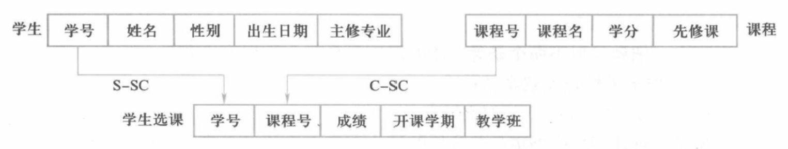

优点

​	能更为直接地描述现实世界，M:N联系容易实现

​	记录之间的联系通过指针实现，查询效率较高。

缺点

​	结构比较复杂，不利于最终用户掌握。

​	编写应用程序较复杂，程序员必须熟悉数据库的逻辑结构。

## 2.2 关系模型

关系模型优点：

​	1. 关系模型建立在严格的数学概念基础上。

​	2. 数据结构简单、清晰，用户易懂易用。

​	3. 关系模型的存取路径对用户隐蔽。有更强的数据独立性、更好的安全保密性，简化了程序员的工作。

## **2.2.3** **关系的键**KEY（码）

超键(SuperKey)：在一个关系中，可**唯一地标识元组的**一个属性或属性集合。

候选键 (Candidate Key)：能唯一标识一个关系的元组而又**不含有多余的属性的**一个属性或属性集合。

**候选键是不是超键？**

候选键是超键的子集，因此：

- **每一个候选键都是超键**。
- **但不是每一个超键都是候选键**，因为超键可以包含冗余属性。

**如果关系的全部属性构成关系的候选键**，则称为**全键(All-Key)**。

构成候选键的诸属性称为**主属性(Prime Attribute**)。

不包含在任意候选键中的属性称为**非主属性(Non-Prime Attribute)**。

**主键 (Primary Key/PK)：**关系中用户选择一个候选键作为插入，删除或检索元组的操作变量，被选用的候选键称为主键。

**外键(Foreign Key/FK)：**是指关系R中的属性A不是关系R的主键，但A是另一个关系S的主键，则属性A就是关系R的外键。其中R是参照关系，S是被参照关系。

外键在关系R中的取值有两种可能：或为**空值**，或必须是**被参照关系S中已有的属性值**。

外键值是否允许为空值，主要依赖于应用环境的语义。

## 2.2.4关系规则

第一范式(First Normal Form，1NF)

实体完整性规则

参照完整性规则

用户定义的完整性规则

**第一范式(First Normal Form，1NF)：**是指关系数据库中表的每一分量都是不可分割的基本数据项（原子性）。

|        | **家庭住址** |          |
| :----: | :----------: | :------: |
| **省** |   **城市**   | **街道** |

这种情况不允许。

**实体完整性规则：**定义关系中主键的取值不能为空值。

**参照完整性规则：**若属性或属性组F是关系R的外键，它与关系S的主键Ks相对应，则对于R中每个元组在F上的值或者取空值；或者等于S中某个元组的主键值。

**用户定义的完整性规则：**针对某一具体关系数据库的约束条件，反映某一具体应用所涉及的数据必须满足的语义要求。

## 2.4.2自然关系运算

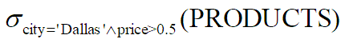

等值连接：

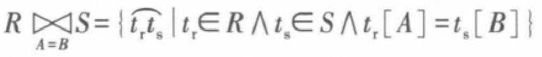

自然连接：

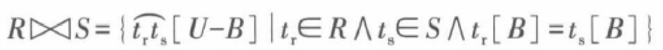

采用θ连接表示如下：

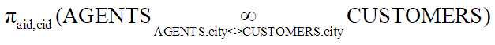

n采用乘法表示如下:

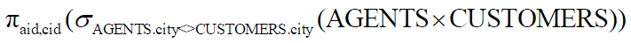


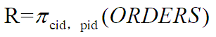

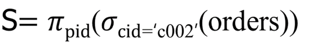

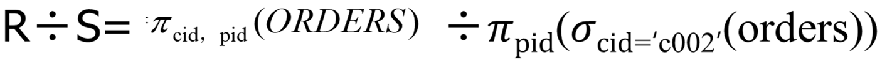

### 题目

3.设有一个数据库Library，包括Book，Borrow，Reader四个关系模式：

Book(Bno，Btitle，Bauthor，Bprice)；

Borrow(Rno，Bno，BorrowDate，ReturnDate)；

Reader(Rno，Rname，Rsex，Rage，Reducation)；

图书表Book由图书编号(Bno)、图书名称(Btitle)、图书作者(Bauthor)、图书价格(Bprice)组成；

借阅表Borrow由读者编号(Rno)、图书编号(Bno)、借阅时间(BorrowDate)、归还时间(ReturnDate)组成；

读者表Reader由读者编号(Rno)、读者姓名(Rname)、读者性别(Rsex)、读者年龄(Rage)、读者学历(Reducation)组成。

针对数据库Library，用关系代数表达式表示下列查询语句。

①查询全体读者的姓名(Rname)、出生年份。

②查询所有年龄在18~20岁(包括18岁和20岁)之间的读者姓名(Rname)及年龄(Rage)。

③查询学历为研究生的读者的编号(Rno)、姓名(Rname)和性别(Rsex)。

④查询读者的借书情况，要求列出读者姓名，图书标题，借书日期。

⑤查询所有读者的基本情况和借书情况，没有借书的读者也输出基本信息。

⑥查询所有借了编号为B02的图书的读者编号(Rno)和读者姓名(Rname)。

⑦查询至少借阅了读者R01借阅的全部书籍的读者编号(Rno)和读者姓名(Rname)。

⑧查询图书名称包含“数据库” 和价格低于50元的图书的信息。

## 3.3 MySQL的组件结构

**连接器：**负责跟客户端建立连接、权限校验、获取权限、维持和管理连接。

**分析器：**对SQL的词法和语法进行分析。词法分析是分析出SQL中字符串代表的含义，识别对应的关键字。语法分析是根据语法的规则判断SQL是否满足MySQL的语法。

**优化器：**选择出最优的查询方案，或者重写查询（对一些执行耗费性能的语句，会依据一些规则，尽
 力转换成某种可高效执行的形式，比如决定表的读取顺序，选择需要的索引等）。

**执行器：**执行优化后的查询方案。执行前要判断当前用户是否有操作表的权限，如果有，则会根据表的存储引擎定义调用相应接口，对数据进行操作；如果无权限则报错。


**引擎层（存储引擎）：**是对于数据库文件的一种存取机制，如何实现存储数据，如何为存储的数据建立索引以及如何更新、查询数据等技术实现的方法。架构模式是插件式的，支持多个存储引擎。

**InnoDB引擎：**事务型存储引擎，提供对数据库事务的ACID支持，实现SQL标准的四种隔离级别，具有行级锁定，适用于高并发情形及外键支持。MySQL 5.5.5 版本后InnoDB成为了默认存储引擎。

**MYISAM引擎：**不支持事务，不支持细粒度的锁（行锁）及外键，当表Insert与update时需要锁定整个表，效率低，高并发时可能会遇到瓶颈。

MYISAM独立于操作系统，可以在Windows及Linux上使用。MYISAM具有高效的查询速度，插入数据的速度很快，在web、数据仓库等应用环境中常用。

**Memory引擎：**表数据是存储在内存中的，由于会受到硬件问题或断电问题的影响，只能将这些表作为临时表或缓存使用。

​	特点：

​	①内存存放，读写速度快

​	②hash索引（默认）

**存储引擎选择：**

​	如果要提供提交、回滚和崩溃恢复能力的事务安全（ACID兼容）能力，并要求实现并发控制，选择InnoDB。

​	如果数据表主要用来插入和查询记录，则MyISAM引擎能提供较高的处理效率。

​	如果只是临时存放数据，数据量不大，并且不需要较高的数据安全性，可以选择将数据保存在内存中的Memory引擎。

## 3.6 MySQL的数据库

### 系统数据库

**mysql：**存储MySQL服务器运行时所需信息的表。包含存储数据库对象元数据的数据字典表、用于其他操作目的的系统表。

**information_schema：** 提供对数据库元数据、有关MySQL服务器的信息（例如数据库或表的名称、列的数据类型或访问权限）的访问。该数据库包含几个只读表（实际上是视图，而不是基表）。

**performance_schema：**该数据库的表是不使用持久磁盘存储的内存表，内容在服务器启动时重新填充，并在服务器关闭时丢弃。提供对有关服务器执行的有用信息的访问，同时对服务器性能的影响最小。

**sys：**通过视图的形式把information_schema和performance_schema 结合起来，帮助系统管理员监控MySQL的技术性能。可用于典型的调优和诊断用例。

### 示例数据库

示例数据库既可以用于日常学习和测试，也可以作为设计数据库的一个参考。

**Sakila ：**是一个在线 DVD 出租数据库。提供了actor、film、film_actor等16个表、7个视图、3个存储过程、3个函数。

**world** 是一个小型的简单数据库，主要用于基础查询测试。

## 4.1 SQL概述

### SQL的特点

 **（1）综合统一**

​	DQL(Data Query Language，数据查询语言 )

​	DML(Data Manipulation Language，数据操纵语言)

​	DDL(Data Definition Language，数据定义语言)

​	DCL(Data Control Language，数据控制语言 ) 

**（2）非过程化**

**（3）面向集合的操作方式**

**（4）提供交互式和嵌入式**

**（5）语言简洁**

| SQL功能  | **关键动词**            |
| :------- | :---------------------- |
| 数据查询 | SELECT                  |
| 数据定义 | CREATE,  DROP, ALTER    |
| 数据操纵 | INSERT,  UPDATE, DELETE |
| 数据控制 | GRANT,  REVOKE          |

安全等于`<=>`运算符是MySQL特有的，表示如果两个操作数相等（即使为NULL），值为真。

### SQL的数据定义语句

| 操作对象 | 创建            | 修改           | 删除          |
| :------- | :-------------- | :------------- | ------------- |
| 数据库   | CREATE DATABASE | ALTER DATABASE | DROP DATABASE |
|          | CREATE SCHEMA   | ALTER SCHEMA   | DROP SCHEMA   |
| 表       | CREATE TABLE    | ALTER TABLE    | DROP TABLE    |
| 视图     | CREATE VIEW     | ALTER VIEW     | DROP VIEW     |
| 索引     | CREATE INDEX    |                | DROP INDEX    |

## 4.2.1 数据库的相关操作

`COLLATE` 选项指定数据库排序规则。规定字符之间如何排序和比较。排序规则和字符集相关，每种排序规则有多种所支持的字符集，每种字符集都指定一种排序规则为默认值。MySQL支持的字符集排序规则有272个。省略表示采用默认值`utf8mb4_0900_ai_ci`。

查看MYSQL支持的字符集

`SHOW CHARACTER SET;`

MySQL共支持41种字符集

**ASCII编码：**采用一个字节存储编码，只有127个字符被编码到计算机里，包括大小写英文字母、数字和一些符号

**Unicode编码：**中文至少需要两个字节，中国制定了GB2312编码，但全世界有上百种语言，在多语言混合的文本中，显示出来会有乱码。Unicode把所有语言都统一到一套编码里，这样就不会再有乱码问题。现在操作系统和大多数编程语言都直接支持Unicode。

**UTF-8编码：**可变长编码，把一个Unicode字符编码成1-6个字节，英文字母编码成1个字节，汉字通常是3个字节，只有很生僻的字符才会被编码成4-6个字节。一般选择UTF-8编码，满足系统运行时可能需要的各类语言编码需求。

**utf8mb3和utf8mb4**，区别在于：most bytes 3和most bytes 4，即最多使用3 / 4个字节来表示1个字符。


### 表的分类

**基本表(Base Table)：**是实际独立存放在数据库中的表，是实表，在SQL中一个关系就对应一个基本表。

**派生表：**派生表是从SELECT语句返回的虚拟表。

**视图**：视图是从一个或几个基本表导出的表。视图是一个虚表。==即数据库中只存放视图的定义而不存放视图对应的数据==

## 4.2.2基本表的相关操作

`create table newtable(id int unsigned,name varchar(64));`

### MySQL的数据类型

数值类型，日期和时间类型，字符串类型，空间类型和JSON数据类型。

1. 定点类型（精确值）包括 `DECIMAL` 和 `NUMERIC`，这两个是同一个意思，使用numeric定义的列会被转换成decimal。

​	例 `salary DECIMAL(5,2)`，5是精度，表示值存储的有效位数，2是小数位数。存储值的范围为-999.99到	999.99。

​	`DECIMAL`在不指定精度时，默认整数为10，小数为0,即(10, 0)。

​	浮点类型（近似值）包括`FLOAT`和 `DOUBLE`，单精度值`FLOAT`使用四个字节，双精度值`DOUBLE`使用八个字	节。

​	当表需要存储小数，并且有精度要求，比如存储金额时，建议使用`DECIMAL`类型。

2. 日期和时间类型：包括`DATE、TIME、DATETIME、TIMESTAMP`和`YEAR`。

   **DATE  :** 用于具有日期部分但没有时间部分的值，以`‘YYYY-MM-DD’`格式检索和显示值。

   **TIME : **以'hh：mm：ss'格式检索和显示值（或'hhh：mm：ss'格式表示大小时值）。 值的范围可以从`'-838:59:59'` 到 `'838:59:59'`。小时部分不仅可用于表示一天中的时间（必须小于 24 小时），还可以表示两个事件之间的经过时间或时间间隔（可能远大于 24 小时，甚至为负数）。

​	**YEAR ：**用于表示年份值的 1 字节类型。MySQL 以 YYYY 格式显示值，范围为 '1901'到'2155'

​	**DATETIME（常用）：**用于同时包含日期和时间部分的值,以`‘YYYY-MM-DD hh:mm:ss[.fraction]’`格式检	索和显示值。占用8个字节，从MySQL5.6版本开始， DATETIME支持毫秒， `DATETIME（N）`中的N表示毫秒	的精度。常用的日期函数也能精确到毫秒。

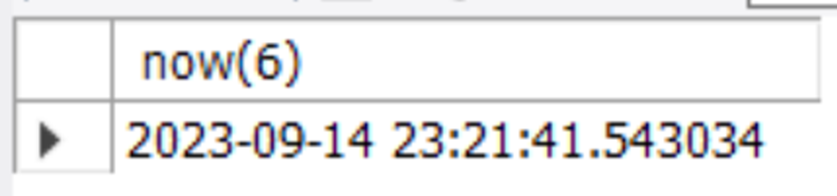

​	**时间戳TIMESTAMP**存储的是自`‘1970-01-01 00:00:00’ UTC`（格林尼治标准时间）(北京时间1970年01月	01日08时00分00秒)到现在的秒数。存储范围`‘1970-01-01 00:00:01’ to ‘2038-01-19 03:14:07’`，占	用4个字节

​	**timestamp**类型适合用来记录数据的最后修改时间，可以设置为只要更改了记录中其他字段值，timestamp	字段的值都会被自动更新。

| **完整性约束条件**                                       | **含义**                                         |
| -------------------------------------------------------- | ------------------------------------------------ |
| PRIMARY  KEY/KEY                                         | 定义主键                                         |
| NOT  NULL/NULL                                           | 定义的属性不能取空值/可以空值                    |
| DEFAULT                                                  | 设置默认值                                       |
| UNIQUE/UNIQUE  KEY                                       | 定义的属性值必须唯一                             |
| FOREIGN  KEY(属性名1)REFERENCES   表名[(属性名2)]        | 定义外键                                         |
| CHECK  (条件表达式)                                      | 定义的属性值须满足CHECK中的条件                  |
| AUTO_INCREMENT                                           | 设置列为自增属性。                               |
| {INDEX  \| KEY} [index_name] [index_type] (key_part,...) | 创建索引                                         |
| CONSTRAINT                                               | 设置约束，主键、唯一键、外键、CHECK 可定义为约束 |

```sql
CREATE TABLE customers (  
cid char(4) NOT NULL PRIMARY KEY, -- 列级完整性约束
cname varchar(30),  
city varchar(50) ,  
discnt float  CHECK(discnt>0)
) ;
```

```sql
-- 创建示例数据库中的订购表ORDERS。
-- 一个数据库中的约束不允许重名，即同一数据库中表与表之间的约束不能同名
CREATE TABLE orders
(ordno char(4) NOT NULL,  
month varchar(12) DEFAULT (LEFT(MONTHNAME(NOW()), 3)),  
cid  char(4) NOT NULL,  
aid char(3) NOT NULL,  
pid char(3) NOT NULL,  
qty float DEFAULT 0,  
dollars float DEFAULT 0,-- 默认值  
PRIMARY KEY (ordno), -- 表级完整性约束
CONSTRAINT aid1 FOREIGN KEY (aid) REFERENCES agents (aid), 
CONSTRAINT cid1 FOREIGN KEY (cid) REFERENCES customers(cid),
CONSTRAINT pid1 FOREIGN KEY (pid) REFERENCES products (pid), 
CONSTRAINT dollars_check1 CHECK (dollars >= 0),  
CONSTRAINT qty_check1 CHECK (qty >= 0) -- 约束
) ;

```

**复制表**

（1）只复制表结构，包括主键、索引，但不会复制表数据

CREATE TABLE *new_tbl* LIKE *orig_tbl*;

**例** `CREATE TABLE customers1 LIKE customers;`

（2）复制表结构及全部数据，但不会复制主键、索引等

CREATE TABLE *new_tbl* [AS] SELECT * FROM *orig_tbl*;

例：`CREATE TABLE customer2 AS SELECT * FROM customers;` 

## 4.3 SQL的数据查询功能

| **查询条件** | **谓词**                                                    |
| ------------ | ----------------------------------------------------------- |
| 比较         | =、<=>、>、<、>=、<=、<>、!=                                |
| 确定范围     | BETWEEN  AND(介于两者之间),NOT  BETWEEN AND(不介于两者之间) |
| 确定集合     | IN(在其中),NOT  IN(不在其中)                                |
| 存在         | EXISTS,NOT  EXISTS                                          |
| 量化比较     | ANY,ALL                                                     |
| 字符匹配     | LIKE(匹配),NOT  LIKE(不匹配)                                |
| 空值         | IS  NULL(是空值),IS  NOT NULL(不是空值)                     |
| 多重条件     | AND(与),OR(或),NOT(非)                                      |

### 查询结果排序

使用`ORDER BY`对查询结果排序。升序排列用`ASC`，降序排列用`DESC`，默认为升序排列。

查询所有的顾客信息，按照顾客姓名(Cname)升序排列。

`select * from customers`

`order by cname asc;`

对于字符排序，按照排序规则，一般升序指从A到Z的顺序，降序指从Z到A的顺序。

### 查询结果分组

`GROUP BY`子句将表中的元组按某一列或多列值分组，值相等的为一组，针对不同的组归纳信息，汇总相关数据。

查询每种产品的订购总量。

`select pid, sum(qty) total` 

`from orders group by pid;`

查询满足条件为某个代理商所订购的某种产品的总量超过1000的代理商ID、产品ID和总量。

`select aid,pid, sum(qty) as total from orders` 

`group by aid,pid having sum(qty) > 1000;`

## 4.3.3 嵌套查询

### IN

```sql
select distinct cid from orders 
where aid in 
(select aid from agents 
where city = 'duluth'or city = 'dallas');
```

```sql
select distinct cid from orders 
where aid in 
(select aid from agents 
where city = 'duluth'or city = 'dallas');
```

```sql
select distinct cid from orders 
where aid in 
(select aid from agents 
where city in ('duluth','dallas'));
```

### NOT IN

查询没有人订购过的产品名称，订购过的产品。

```sql
Select pname from products
where pid not in (select pid from orders); 
```

查询佣金百分率最小的代理商的aid值。

第一种写法：

`select aid from agents where percent<=all`

`(select percent from agents);` 

第二种写法：

`Select aid from agents where` 

`percent = (select min(percent) from agents);`

| 量化比较谓词                         | 含义                           | 量化比较谓词     | 含义                           |
| ------------------------------------ | ------------------------------ | ---------------- | ------------------------------ |
| ＞ANY  ＞SOME                        | 大于子查询结果中的某一个值     | ＞ALL            | 大于子查询结果中的所有值       |
| ＜ANY  ＜SOME                        | 小于子查询结果中的某一个值     | ＜ALL            | 小于子查询结果中的所有值       |
| ＞＝ANY  ＞＝SOME                    | 大于等于子查询结果中的某一个值 | ＞＝ALL          | 大于等于子查询结果中的所有值   |
| ＜＝ANY  ＜＝SOME                    | 小于等于子查询结果中的某一个值 | ＜＝ALL          | 小于等于子查询结果中的所有值   |
| ＝ANY  ＝SOME                        | 等于子查询结果中的某一个值     | ＝ALL            | 等于子查询结果中的所有值       |
| ！＝ANY或＜＞ANY  ！＝SOME或＜＞SOME | 不等于子查询结果中的某一个值   | ！＝ALL或＜＞ALL | 不等于子查询结果中的任何一个值 |

### 带有EXISTS谓词的子查询

语法格式为：

EXISTS (子查询)

当且仅当子查询返回的集合存在元素，即非空，其值为真。

带有exists谓词的子查询不返回任何数据，只产生逻辑真值true或逻辑假值false，子查询给出列名无实际意义。

由于带exists谓词的相关子查询只关心内层查询是否有返回值，并不需要具体查询值，有时候是高效的方法。

e.g. 查询既订购了产品p01又订购了产品p07的顾客的cid。

```sql
select distinct cid from orders x 
where pid='p01' and exists
(select * from orders 
where cid=x.cid and pid='p07');
```

语法格式为：

NOT EXISTS (子查询)

e.g. 当且仅当子查询返回的集合不存在元素，即为空，其值为真。查询没有通过代理商a05订货的所有顾客的名字。

```sql
select distinct c.cname from customers c 
where not exists 
(select * from orders x
where c.cid=x.cid and x.aid='a05');
```

### 关于EXISTS子查询的说明：

1) 一些带EXISTS或NOT EXISTS谓词的子查询不能被其它形式的子查询等价替换。

2) 所有带IN谓词、比较运算符、SOME(ANY)和ALL谓词的子查询都能用带EXISTS谓词的子查询等价替换。

3) [NOT] EXISTS子查询的效率要优于连接查询和集合查询（IN谓词查询）。

## 4.3.5 复杂查询 

查询订购了所有产品的顾客的cid值。

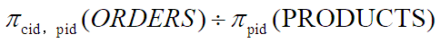

对于“订购了所有产品的顾客”，可以等价于“没有一个产品该顾客没有订购”，所以：

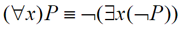

第一步：用SQL语句描述反例：有一个产品我们的候选顾客没有订购；

`select pid from products x` 

`where not exists` 

 `(select * from orders y` 

 `where x.pid = y.pid and y.cid = ？.cid)`

第二步：用SQL语句描述不存在反例。

`not exists`

`(select pid from products x where not exists` 

`(select * from orders y` 

`where x.pid = y.pid and y.cid = ？.cid))`

第三步：完成该查询。

```sql
select c.cid from customers c
where not exists
(select pid from products x where not exists 
(select * from orders y
	where x.pid = y.pid and y.cid = c.cid))
```

对于需要用关系代数除法解决的查询问题，转换成SQL语句的一般形式为：

`Select …… where NOT EXISTS(select …… where NOT EXISTS(select …… ))；`

 查询被所有居住在New York的顾客订购的产品的pid。

`select pid from products p` 

`where not exists` 

`(select cid from customers c` 

`where c.city = 'new york' and not exists` 

`(select * from orders x` 

`where x.pid = p.pid and x.cid = c.cid));`

## 4.4 SQL的数据操纵功能

### 更新数据

将所有订货总金额超过2000的顾客的折扣率增加10%。

```sql
update customers 
set discnt=discnt*1.1 
where cid in 
	(select cid from orders 
	group by cid having sum(dollars)>2000);
```

### 删除数据

单表删除命令格式为：
DELETE FROM <表名> [WHERE<条件>]
【例45】 删除数据表agents中的居住在“New York”的所有代理商的记录。
`delete from agents  
where city = 'new york'`
【例46】 删除所有没有人订购的产品。
`delete from products
where pid not in (select pid from orders)`

删除表中所有数据
`delete from agents;` 
`delete`是逐行删除，速度极慢，不适合大量数据删除。
`TRUNCATE TABLE table_name;`
`TRUNCATE`删除所有数据，保留表结构，适合删除拥有大量数据的表
如使用InnoDB，在删除数据之前检查表中是否有可用的外键约束。如果外键约束指定DELETE CASCADE，则子表中的相应行也将被删除。否则将逐个删除行，遇到由子表中的行引用的行时，将停止并发出错误。
如果表没有任何外键约束，则TRUNCATE TABLE语句将删除该表并重新创建一个具有相同结构的新表

## 4.5视图

**视图(VIEW):**是从一个或几个基本表(或视图)导出的一个虚拟表。数据库中只存放了视图的定义。

视图中的数据依赖于原来表中的数据，一旦表中数据发生改变，视图中的数据也会发生改变。

**优点：**

提高安全性。  

重复利用SQL语句，简化操作。

逻辑数据独立性。

CREATE VIEW *view_name* [<*column_name*>[,< *column_name* >][ ,...n )] 

AS *select_statement* [WITH CHECK OPTION]

==WITH CHECK OPTION==：对视图进行更新操作时要保证更新的行满足视图查询语句中的条件表达式。

表和视图共享数据库中相同的名称空间，因此，数据库不能包含具有相同名称的表和视图。

创建一个视图custp01，列出订购了产品p01的顾客编号、姓名、产品编号、产品数量和总金额。

```sql
create view custp01 
As select c.cid,cname,pid,qty,dollars
from customers c, orders o
where c.cid = o.cid and o.pid ='p01';
```

建立一个视图，查询折扣率小于15的顾客信息。

```sql
create view cust1 as
select * from customers 
where discnt<15; 

create view cust2 as 
select * from customers 
where discnt<15 with check option; 
```

视图分为只读视图、可更新视图和可插入视图
如果视图包含以下任何内容，则该视图为**只读视图（不可更新）：**
`集合函数`
`DISTINCT`
`GROUP BY`
`HAVING`
`并集`
`非相关子查询对于 INSERT 失败，但可以UPDATE和DELETE。对于相关子查询，不允许使用任何数据更改语句。`
`某些连接`
`在子句中引用不可更新视图`
`使用临时表`

**可插入视图**
如果可更新视图还满足视图列的以下附加要求，则该视图是可插入的：
不能有重复的视图列名称。
该视图必须包含基表中没有缺省值的所有列。
视图列必须是简单的列引用。它们不能是表达式，例如：
3.14159 
col1 + 3 
UPPER(col2)

## 4.6 索引

索引是存储引擎用于快速找到记录的一种数据结构。

### 建立索引的优点

1. 大大加快数据的检索速度;
2. 创建唯一性索引，保证数据库表中每一行数据的唯一性;
3. 加速表和表之间的连接;
4. 在使用分组和排序子句进行数据检索时，可以显著减少查询中分组和排序的时间。

### 索引的缺点

1. 索引需要占物理空间。

2. 当对表中的数据进行增加、删除和修改的时候，索引也要动态的维护，降低了数据的维护速度。

### MySQL索引类型

根据索引的具体用途，在逻辑上分为 5 类：

1. 普通索引： MySQL 中最基本的索引类型，目的就是加快系统对数据的访问速度。允许在定义索引的列中插入重复值和空值。
   `create index indexname on tablename (字段名称);`
   `alert table tablename add index [索引的名字] (字段名);`
2. 唯一索引：索引列值必须唯一，允许有空值。
   `create UNIQUE index indexname on tablename (字段名称);`
   `alert table tablename add UNIQUE index [索引的名字] (字段名);`

3. 主键索引：一种特殊的唯一索引，不允许值重复或者为空。创建主键索引在创建表时使用 PRIMARY KEY ，不能使用 CREATE INDEX 语句创建。
   `CREATE TABLE tablename ([...], PRIMARY KEY (字段名) );`
   `ALTER TABLE tablename ADD PRIMARY KEY (字段名);`
4. 空间索引：是对空间数据类型GEOMETRY的字段建立的索引，使用 SPATIAL 关键字进行扩展。
   `create SPATIAL index indexname on tablename (字段名称);`
   `alert table tablename add SPATIAL index [索引的名字] (字段名);`

5. 全文索引：用来查找文本中的关键字，只能在 CHAR、VARCHAR 或 TEXT 类型的列上创建。对于大容量的数据表，生成全文索引非常消耗时间和硬盘空间。
   `CREATE FULLTEXT INDEX <索引的名字> ON tablename (字段名);`
   `ALTER TABLE tablename ADD FULLTEXT [索引的名字] (字段名);`

**从数据存储和索引键值逻辑关系划分：聚集（聚簇）索引、非聚集（聚簇）索引**
InnoDB的聚簇索引按照主键顺序构建 B+Tree结构。在叶子节点行记录和主键值紧凑地存储在一起。

InnoDB的表要求必须要有**聚簇索引：**

如果表定义了主键，则主键索引就是**聚簇索引**

如果表没有定义主键，则第一个非空unique列作为聚簇索引

否则InnoDB会建一个隐藏的row-id作为聚簇索引

**非聚集索引：**根据索引列构建 B+Tree结构。但在 B+Tree 的叶子节点中只存了索引列和主键的信息。

一个表可以创建多个非聚集索引。

**回表查询：**通过非聚集索引（InnoDB辅助索引）无法直接定位行记录，通常情况下，需要扫描两遍索引树。先通

过辅助索引定位主键值，然后再通过聚簇索引定位行记录，叫做回表查询，它的性能比扫一遍索引树低。

**索引覆盖：**只需要在一棵索引树上就能获取SQL所需的所有列数据，无需回表，速度更快，叫做索引覆盖。 实现

索引覆盖最常见的方法就是：将被查询的字段，建立成组合索引。


**一般来说，应该在这些列上创建索引：**

经常需要搜索的列上，可以加快搜索的速度；

在作为主键的列上；

经常用在连接的列上，这些列主要是一些外键，可以加快连接的速度；

经常需要根据范围进行搜索的列上创建索引；

如date>”20050101” and date< “20050131”；

经常需要排序的列上创建索引；

经常使用在WHERE子句中的列创建索引。

**一般来说，不应该创建索引的列：**

在查询中很少使用的列。

那些只有很少数据值的列也不应该创建索引。

定义为text, bit数据类型的列不应该创建索引。

当修改性能远远大于检索性能时，不应该创建索引。

## 5.1数据库的完整性

### 完整性规则

为维护数据库的完整性，DBMS必须设计：

触发条件：规定系统什么时候使用规则来检查数据。 

约束条件：检查用户发出的操作请求违背了什么样的完整性约束条件。 

违约响应：规定系统如果发现用户的操作违约时要做的事情。 

实体完整性：通过主键来标识某个独一无二的实体

参照完整性：通过外键标识某两个实体之间的联系

用户定义的完整性：针对某一具体字段的数据要求


### 实体完整性

主键保证，主键唯一，且不能为空

建表时用PRIMARY KEY定义。

ALTER TABLE也可以增加主键约束。

判断主键唯一，一般需要全表扫描，但这样太过耗时，因此关系系统一般在主键上自动建立一个索引

### 参照完整性

通过外键实现

实现两表之间相关数据的一致性。

外键约束在建表时创建，或者修改表时增加

在对被参照表或参照表进行更新时，可能破坏参照完整性，因此更新之前必须保证两个表的相容性。

### 用户定义的完整性

针对某一具体应用的数据必须满足的语义要求。

在建表或修改表结构时，可以根据要求定义属性上的约束条件，如N`OT NULL、UNIQUE、DEFAULT、CHECK()、auto_increment`等。

### 触发器

触发器是一种特殊的存储过程，是由事件来触发某个操作。当数据库执行UPDATE，INSERT和DELETE等事件时，

就会激活触发器执行相应的操作。这些事件称为触发条件。

#### 作用:

**安全性**。能够基于数据库的值使用户具有操作数据库的某种权利。比如：能够基于时间限制用户的操作，比如不同

意下班后和节假日改动数据库数据。

**审计**。能够跟踪用户对数据库的操作。

**实现复杂**的数据完整性规则。

**同步实时**地复制表中的数据。

**主动计算数据值**，假设数据的值达到了一定的要求，则进行特定的处理。比如，假设公司的帐号上的资金低于5万

元则马上给財务人员发送警告数据。

#### 触发器缺点

触发器定义在表上，在SQL语句执行前/后触发，针对每一行执行，因此在对增删改查频繁的表上不建议使用触发器，除非确定触发器是非常高效的。

触发器能在一定程度上减少代码的编写，但其满足条件自动触发，增加了系统复杂性，使排错更加费时。

不能提升系统的性能，相反还可能降低数据库性能，在业务复杂的时候还可能造成死锁。


**BEFORE/AFTER：**触发器被触发的时刻。**BEFORE**指触发器在触发事件之前发生，**AFTER**指触发器在触发事件之后发生。

e.g. 建立一个触发器，当向orders表中插入一个新订单时被触发，自动更新products表的quantity列，即把在orders表中指定的qty从products表相应行的quantity中减去。

```sql
DELIMITER $
DROP TRIGGER IF EXISTS ortri1$
CREATE TRIGGER ortri1 AFTER INSERT ON orders 
FOR EACH ROW
BEGIN
UPDATE products SET quantity=quantity-new.qty WHERE pid = new.pid;
END$
DELIMITER ;
```

FOR EACH ROW：行级触发，受触发事件影响的每一行都要激活触发器的动作。不可省略。

## 5.2 数据库的安全性

### 数据库安全性

​	保护数据库防止恶意破坏和非法的存取

​	防范对象是非法用户和非法操作

非法使用数据库的情况：

1. 编写一段合法程序绕过DBMS及其授权机制，通过操作系统直接存取、修改或备份数据库数据；

2. 直接或编写应用程序执行非授权操作；

3. 通过多次合法查询数据库从中推导出一些保密数据;

### 数据库安全性控制的常用方法

1) 用户标识与鉴定

​	系统提供的最外层安全保护措施

​	基本方法

​	系统提供一定的方式让用户标识自己的名字或身份；

​	系统内部记录着所有合法用户的标识；

​	每次用户要求进入系统时，由系统核对用户提供的身份标识；

​	通过鉴定后才提供机器使用权。

​	用户标识和鉴定可以重复多次。

2. 存取控制

3. 视图

4. 审计

5. 加密存储

### MySQL 角色管理

`CREATE ROLE 'role_name'[@'host_name'] [,'role_name'[@'host_name']]...`

例：

`CREATE ROLE ‘SalesRole’@‘localhost’;`

角色和用户比较：

创建时都会在mysql.user表中创建记录

角色没有密码，且是被锁定状态，不能登录

为用户分配角色

角色创建并授权后，要赋给用户并处于激活状态才能发挥作用。

`GRANT role [,role2,...] TO user [,user2,...];`

`GRANT ‘SalesRole’@‘localhost’  TO 'SQLUser1'@'localhost' ;`

将角色赋给用户，查看该用户的权限会显示出来。但是还需要激活角色，才能使角色生效。

激活角色：定义当用户连接到服务器并进行身份验证或用户在会话期间，哪些角色将变为活动状态

```sql
SET DEFAULT ROLE
    {NONE | ALL | role [, role ] ...}
    TO user [, user ] ...
-- 单个激活
SET DEFAULT ROLE ALL TO 'zhangsan'@'localhost'; 
--  批量激活
SET DEFAULT ROLE ALL TO 'dev1'@'localhost','read_user1'@'localhost','read_user2'@'localhost‘;
```

### 存取控制机制的功能

确保只授权给有资格的用户访问DB的权限。

存取控制机制的组成

 定义存取权限

 检查存取权限

用户权限定义和合法权检查机制一起组成了DBMS的安全子系统。

DBMS所采取的存取控制策略主要有两种:

**自主存取控制(Discretionary Access Control ，简称DAC）:**用户对于不同的数据库对象有不同的存取权限,不同的

用户对同一对象也有不同的权限,而且用户还可将其拥有的存取权限转授给其他用户。

自主存取控制灵活,常用。

标准SQL提供了自主存取控制的语句，即GRANT/REVOKE

**强制存取控制 （Mandatory Access Control，简称 MAC）:**

每一个数据库对象被标以一定的密级,每一个用户也被授予某一个级别的许可证。

对于任意一个对象,只有具有合法许可证的用户才可以存取。

强制存取控制相对比较严格，只在某些专用系统中有用,例如军事部门或政府部门。 

### 视图机制

视图机制把要保密的数据对无权存取这些数据的用户隐藏起来。

方法

首先用视图机制屏蔽掉一部分保密数据；

对视图定义存取权限。

### 审计Audit

启用一个专用的审计日志（Audit Log），跟踪和记录用户对数据库的所有操作；

DBA可以利用审计日志中的追踪信息，找出非法存取数据的用户；

审计很费时间和空间；

DBA可以根据应用对安全性的要求，灵活地打开或关闭审计功能。

MySQL社区版是不带审计功能

### 数据加密

数据加密：通过将数据更改为不可读形式而使敏感数据得以保密的方法。

加密的基本思想

根据一定的算法将原始数据（明文，Plain text）变换为不可直接识别的格式（密文，Cipher text）

`SELECT * FROM mysql.user;`

## 6.1.1变量的定义和使用

局部变量通过set语句赋值

set var_name=expr [, var_name=expr]…; 

例 declare x,y int;

   set x=1,y=2;

用select … into…形式赋值

select col_name[,...] into var_name[,...] FROM table_expr [where...];

例 select count(*) into total_cus FROM customers;

用户变量：在客户端链接到数据库实例整个过程中用户变量都是有效的。

MySQL中用户变量不用事前声明，直接用“@变量名”使用就可以。用户变量名必须以@开头。

第一种用法：set @num=1; 或set @num:=1; 

第二种用法：select @num:=1; 或 select @num:=字段名 from 表名 where ……，

select语句用来输出用户变量

系统变量 分为全局变量与会话变量。

全局变量在MySQL启动的时候由服务器自动初始化为默认值，可以通过更改my.ini来更改。

会话变量在每次建立一个新的连接时，由MySQL初始化，将当前所有全局变量的值复制一份，作为会话变量。

全局变量与会话变量的区别：

对全局变量的修改会影响到整个服务器；

对会话变量的修改，只会影响到当前的会话（即当前的数据库连接）。

### IF语句

```sql
IF age>20 THEN SET @count1=@count1+1;
    ELSEIF age=20 THEN 
      set @count2=@count2+1;
    ELSE set @count3=@count3+1;
END lF;
```

### CASE语句

```sql
CASE age
    WHEN 20 THEN SET @count1=@count1+1;
    ELSE SET @count2=@count2+1;
END CASE;
-- 或
CASE
    WHEN age=20 THEN SET @count1=@count1+1;
    ELSE SET @count2=@count2+1;
END CASE;
```

### LOOP 语句

可以使某些特定的语句重复执行。LOOP 语句本身没有停止循环的语句，必须使用 LEAVE等语句才能停止循环，

跳出循环过程。

```sql
add_num:LOOP
    SET @count=@count+1;
END LOOP add_num;
```

### LEAVE 语句

用于跳出循环控制。

LEAVE label

label 参数表示循环的标志

```sql
add_num:LOOP
    SET @count=@count+1;
    IF @count=100 THEN
        LEAVE add_num;
END LOOP add_num;
```

### ITERATE 语句

跳出本次循环，直接进入下一次循环。

ITERATE label

label 参数表示循环的标志

```sql
add_num:LOOP
    SET @count=@count+1;
    IF @count=100 THEN
        LEAVE add_num;
    ELSE IF MOD(@count,3)=0 THEN
        ITERATE add_num;
    SELECT * FROM employee;
END LOOP add_num;
```

### REPEAT 语句

是有条件控制的循环语句，每次语句执行完毕后，会对条件表达式进行判断，如果表达式返回值为 TRUE，则循环

结束，否则重复执行循环中的语句。

```sql
REPEAT
    SET @count=@count+1;
    UNTIL @count=100
END REPEAT;
```

### WHILE 语句

```sql
WHILE @count<100 DO
    SET @count=@count+1;
END WHILE;
```

## 6.2 存储过程

**存储过程**是 SQL 语句和可选流程控制语句的预编译集合，以一个名称存储并作为一个单元处理。

**存储过程**可包含程序流、逻辑以及对数据库的查询。可以接受参数、输出参数、返回单个或多个结果集。

触发器、其他存储过程以及Java，Python，PHP等应用程序可以调用存储过程

**存储过程**一般可以嵌套，即一个存储过程可以调用另一个存储过程，但MySQL不支持递归存储过程。

### 存储过程的优点

**允许模块化程序设计**，存储过程对任何应用程序都是可重用的和透明的。

**有助于提高应用程序的性能**。MySQL存储过程按需编译，并在高速缓存中保留存储过程的编译版本，以便以后使

用，从而缩短了执行时间。 

**减少网络流量**。

**可作为安全机制使用**。DBA可以向访问数据库中存储过程的应用程序授予适当的权限，而不向基础数据库表提供

任何权限。

创建存储过程proc_Qcustomer：通过顾客的cid来查询顾客的姓名、城市和这个顾客的折扣。

```sql
DELIMITER $$
CREATE PROCEDURE proc_Qcustomer (IN in_cid char(4),OUT out_cname varchar(30),OUT out_city varchar(50),OUT out_discnt float)
begin 
SELECT cname, city, discnt into out_cname, out_city, out_discnt FROM customers WHERE cid = in_cid;
End$$
DELIMITER ;
```

创建存储过程customerLevel，通过顾客的cid计算顾客购买的全部商品的总金额，根据总金额设置用户级别，如

果总金额大于3000，顾客等级为A，总金额大于1000并且小于等于3000，顾客等级为B，总金额小于1000，顾客

等级为C，从来未购买商品的顾客，等级为D。

```sql
DELIMITER $$
CREATE PROCEDURE customerLevel(in  p_customerNumber char(4),     out p_customerLevel  char(2))    
BEGIN    
DECLARE totaldollar float; --局部变量   
SELECT sum(dollars) INTO totaldollar    FROM orders     WHERE cid=p_customerNumber;    
IF totaldollar > 3000 THEN    
set p_customerLevel='A';    
ELSEIF (totaldollar  >= 1000) THEN    
set p_customerLevel='B';    
ELSEIF totaldollar < 1000 THEN    
set p_customerLevel='C';    
elseif totaldollar is null then   
 set p_customerLevel='D';   
 END IF;    
end$$
DELIMITER ;
```

### MySQL使用存储过程返回表

```sql
DELIMITER //
CREATE PROCEDURE getorder(cid1 char(4) )
BEGIN
select * from orders where cid=cid1;
END//
DELIMITER ;
```

## 6.3 函数

函数是由一个或多个 SQL 语句组成的子程序，可用于封装代码以便重新使用。

### 优点：

允许模块化程序设计。

执行速度更快。使用函数时无需重新解析和重新优化，从而缩短了执行时间。

减少网络流量。

使用灵活。 

### 存储过程和函数的区别

存储过程可以返回输出参数或表，而函数只能返回值。

存储过程一般是作为一个独立的部分来执行，而函数可以作为查询语句的一个部分来调用。

函数在系统启动时就进行编译并加载，存储过程在调用时才加载。

MySQL 支持两种函数类型： 

系统函数（内置函数）： 系统定义且不能修改。

用户定义函数

### 系统函数类型：

1. 控制流程函数

2. 字符串函数

3. 数学函数
4. 日期时间函数

5. 搜索函数

6. 加密函数

7. 信息函数 
8. 其他函数 
9. 聚合函数

returnVarType: 返回值类型。函数必须有且只能有一个返回值

创建一个函数F_Price ，要求：根据顾客姓名和商品名，查询顾客订购该商品的总价。 

```sql
USE sales;
DROP function IF EXISTS F_Price;
DELIMITER $$
CREATE FUNCTION F_Price (in_cname char(50),in_pname char(50))
RETURNS float
READS SQL DATA    -- 意为函数体包含读数据sql语句
RETURN (SELECT sum(dollars) FROM orders,customers,products
        WHERE orders.cid=customers.cid 
		AND orders.pid=products.pid 
        AND customers.cname=in_cname 
		AND products.pname=in_pname) $$
DELIMITER ;
```

## 6.4 游标

游标是系统为用户开设的一个数据缓冲区，存放SQL语句的执行结果，是一种临时的数据库对象。

游标可以对结果集中的每一条记录进行定位，并对指向的记录中的数据进行操作，充当了指针的作用

每个游标区都有一个名字 

MySQL中游标可以在存储过程和函数中使用

用户也可以用SQL语句逐一从游标中获取记录，并赋给变量，交由高级程序设计语言进一步处理。

## 7.1 事务

MySQL使用下列语句来管理事务：

开始事务：`START TRANSACTION` 或 `BEGIN`

提交事务：`COMMIT` 

回滚（撤销）事务：`ROLLBACK` 

一旦事务提交或回滚，则事务结束。

`COMMIT`提交事务的所有操作，保证事务的所有修改在数据库中都永久有效，同时释放事务使用的资源（例如

锁）。

`ROLLBACK`在事务运行的过程中出现错误，或用户决定取消事务，系统将事务中对数据库的所有已完成的操作全部

撤销，数据返回到事务开始时所处的状态，同时释放事务占用的资源。

### 事务的分类：

显式事务：用START TRANSACTION 或 BEGIN明确指定事务的开始，这是最常用的事务类型

隐性事务：是 MySQL的默认模式，将每条单独的 SQL 语句视为一个事务，如果成功执行，则自动提交；如果错

误，则自动回滚。

直接用 SET 来改变 MySQL 的自动提交模式:

SET AUTOCOMMIT=0 禁止自动提交

SET AUTOCOMMIT=1 开启自动提交

### 事务的ACID特性

**原子性（Atomicity）**：事务是一个完整的操作。事务的各步操作是不可分的（原子的）；要么都执行，要么都不

执行。

**一致性（Consistency）**：当事务完成时，数据必须处于一致状态。

**隔离性（Isolation）**：对数据进行修改的所有并发事务是彼此隔离的，这表明事务必须是独立的，它不应以任何方

式依赖于或影响其他事务。

**永久性（Durability）**：事务完成后，它对数据库的修改被永久保持。

## 7.2.1 并发操作引起的异常

丢失更新（Lost Update）

未提交读（Uncommitted read），也称为“脏读” 

不可重复读（Nonrepeatable read）

幻象读（Phantom read）

### 并发控制机制：是衡量DBMS系统性能的指标之一

并发控制是以**事务**为单位进行的。

并发控制机制的任务

1. 对并发操作进行正确调度

2. 保证事务的隔离性

3. 保证数据库的一致性

封锁技术 (Locking)是并发控制的主要技术

## 7.2.3 封锁

事务T在对某个数据对象(如数据库、表、记录等)操作之前，首先向系统发出加锁请求以便获得对数据对象相应的

控制；

在事务T释放它所获得的锁之前，其他事务不能更新此数据对象。

### 排它锁(eXclusive lock)：写锁

若事务T对数据对象A加上X锁，则只允许T读取和修改A，其它任何事务都不能再对A加任何类型的锁，直到T释放A

上的锁

### 共享锁(Share lock)：读锁

若事务T对数据对象A加上S锁，则事务T可以读A但不能修改A，其它事务只能再对A加S锁，而不能加X锁，直到T释

放A上的S锁

### 三个级别的封锁协议

#### 一级封锁协议

==内容：事务T在修改数据R之前必须先对其加X 锁，直至事务结束==

事务结束包括正常结束（COMMIT）和非正常结束（ROLLBACK）

评价：是否可解决

丢失修改？可以防止

可重复读？不能保证

读脏数据？不能防止

在协议中，如果是读数据，不需要加锁，所以不能保证可重复读和不读“脏”数据。

#### 二级封锁协议

内容：

==读数据前加S锁，读完即释放，写数据前加X 锁直至事务结束==

评价：是否可解决

丢失修改？可以防止

可重复读？不能保证

读脏数据？可以防止

三级封锁协议

内容：

==读数据前加S锁直至事务结束，写数据前加X 锁直至事务结束==

评价：是否可解决

丢失修改？可以防止

可重复读？可以保证

读脏数据？可以保证

## 7.2.4 死锁

事务T1和T2各自封锁了数据R1和R2后，又各自请求封锁R2和R1，因都无法获得而等待对方释放的现象

### 解决的两类方法

​	预防死锁

​	死锁的诊断与解除

**一次封锁法**

办法：每个事务一次将所有要使用的数据全部加锁

存在问题？降低并发度

**顺序封锁法**

办法：预先规定数据对象的封锁顺序，所有事务均按此顺序

存在问题？维护成本高

==因此DBMS普遍采用诊断并解除死锁的办法==

### 死锁的诊断

#### 超时法

办法：等待时间超过规定的时限

优点：实现简单

缺点

有可能误判死锁

时限若设置得太长，死锁发生后不能及时发现

#### 等待图法

办法：画等待图，发现回路

### 死锁的解决

检测到死锁，选择一个处理死锁代价最小的事务，强行撤销，使其它事务可以继续下去

恢复撤销事务所执行的数据修改操作

## 7.2.5 事务调度的可串行性

**可串行化**（Serializable）的调度：多个事务的并发执行是正确的，当且仅当其结果与按某一次序串行地执行

它们时的结果相同

为了保证并发操作的正确性，DBMS的并发控制机制必须提供一定的手段来保证调度是可串行化的

保证事务调度可串行性的策略

==两段锁(Two-Phase Locking, 2PL)协议==

两段锁协议的内容
1. 在对任何数据进行读、写操作之前，事务首先要获得对该数据的封锁
2. 在释放一个封锁之后，事务不再获得任何其他封锁

==两段锁协议是可串行化调度的充分条件，但不是必要条件==

若并发事务都遵守两段锁协议，则对这些事务的任何并发调度策略都是可串行化的；

若对并发事务的一个调度是可串行化的，不一定所有事务都符合两段锁协议

==两段锁协议可以保证并发事务的正确性，但可能发生死锁==

## 7.2.6 封锁的粒度

封锁的粒度即封锁对象的大小，如

逻辑单元：属性、元组、关系、索引、数据库等

物理单元：页、块等

封锁粒度对并发控制的影响

封锁粒度越大，并发度越小，系统封锁开销越小；

封锁粒度越小，并发度越高，系统封锁开销越大；

## 7.2.7 MySQL的锁

MySQL的锁分为表级锁和行级锁。
（1）表级锁：是以表为单位进行加锁，开销小，加锁快，不会出现死锁。锁粒度大，发生锁冲突的概率最高，并

发度最低，表级锁适合做查询为主的场景，如小型的Web应用。

表级锁包括：表共享读锁（Table Read Lock）和表独占写锁(Table Write Lock)。

对于读操作，可以增加读锁，一旦数据表被加上读锁，其他请求可以对该表再次增加读锁，但是不能增加写锁。

对于写操作，可以增加写锁，一旦数据表被加上写锁，其他请求无法对该表增加读锁和写锁。

MySQL表级锁加入方式：

LOCK TABLES 表名 READ

​      [表名 WRITE]...;

MySQL解锁方式：

UNLOCK TABLES；

（2）行级锁：是以记录为单位进行加锁。开销大，加锁慢，会出现死锁。锁粒度最小，发生锁冲突的概率最低，

并发度也最高。

行级锁适用于高并发环境下，对事务完整性要求较高的系统，如在线事务处理系统。

行级锁包括共享锁（S锁）和排它锁（X锁）。

MySQL行级共享锁加锁方式：

SELECT * FROM 表名 WHERE 条件 LOCK IN SHARE MODE；

解锁方式：COMMIT/ROLLBACK。

MySQL行级排他锁加锁方式：

自动方式：在更新（INSERT、UPDATE、DELETE）语句中，MySQL将会对符合条件的记录默认自动加上X锁。

手动加入方式：SELECT * FROM 表名 WHERE 条件 FOR UPDATE；

（3）表的意向锁

意向锁是隐式的表级锁，数据库开发人员在向表中的某些记录加行级锁时，MySQL首先会自动向该表施加意向

锁，然后再施加行级锁。

意向锁是数据引擎自己维护的，用户无法手动操作意向锁。

MySQL提供两种意向锁：意向共享锁（IS）和意向排他锁（IX）。

